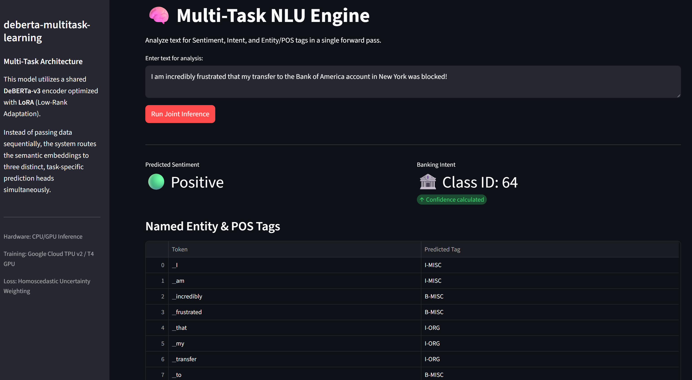

# DeBERTa Multi-Task Learning (NLU)

An optimized, parameter-efficient Multi-Task Learning (MTL) architecture designed to handle sentence-level classification and token-level tagging simultaneously through a single, shared Transformer backbone.

This repository contains an end-to-end training, balancing, and deploying a multi-headed NLU engine. It features dynamic gradient balancing, LoRA adapter injection, and strict data pipelines optimized for PyTorch XLA (TPU) and CUDA (GPU) hardware acceleration.

## Supported Tasks
The model routes semantic embeddings to three distinct, task-specific prediction heads in a single forward pass:
1. **Sentiment Analysis** (Sentence-level, Binary Classification via SST-2)
2. **Intent Classification** (Sentence-level, 77-Class via Banking77)
3. **Named Entity / POS Tagging** (Token-level, 9-Class Token Classification via CoNLL-2003)

<br>



<br>

## 🏗️ Architectural Rationale

The goal is to maximize shared representation learning while minimizing catastrophic forgetting and computational overhead. 

### 1. DeBERTa-v3 shared backbone
I utilized `microsoft/deberta-v3-base` instead of standard BERT/RoBERTa. DeBERTa's disentangled attention mechanism (which computes word content and word position separately) provides significantly richer semantic representations, making it ideal for joint-learning scenarios where token context is heavily relied upon by the POS tagging head.

### 2. LoRA PEFT
Fine-tuning all 130M+ parameters of DeBERTa across three conflicting tasks frequently leads to catastrophic forgetting. To prevent this, the base weights are completely frozen. I injected LoRA matrices (`r=8`, `alpha=16`) exclusively into the attention mechanism's Query and Value projections. 
With this, We only need to train a fraction of the parameters (~0.6%).

### 3. Dynamic Router
The model does not run all heads simultaneously during training. Tensors are tagged with a `task_name` routing key by a custom `MultiTaskBatchSampler`. In the `forward()` pass, the network dynamically extracts either the `[CLS]` token equivalent (for Sentiment/Intent tasks) or the full sequence (for POS) and routes it strictly to the active mathematical head, saving compute cycles.

---

## The Math: Homoscedastic Task Uncertainty Weighting

**The Problem:** In Multi-Task Learning, if you simply sum the losses ($L_{total} = L_1 + L_2 + L_3$), token-level tasks like POS tagging (which calculate error across 128 tokens per sequence) will produce gradients that are orders of magnitude larger than sentence-level tasks. The network will exclusively optimize for POS tagging and completely ignore Sentiment and Intent.

**The Solution:** This architecture implements **Homoscedastic Task Uncertainty Weighting** (Kendall et al., 2017).

I introduced a learnable noise parameter, $\sigma$, for each task. The network learns these parameters concurrently with the model weights. To ensure numerical stability (preventing negative variance), it learns the log-variance: $s = \log(\sigma^2)$.

The dynamic loss function is defined as:

$$L_{total} = \sum_{i=1}^{T} \left( e^{-s_i} L_i + s_i \right)$$

* **The Scaling Factor ($e^{-s_i}$):** If a task (like POS) generates massive, noisy loss, the network actively learns to increase $s_i$. This exponentially shrinks the multiplier, suppressing the dominant gradient and allowing quieter tasks to update the shared LoRA weights.
* **The Penalty ($s_i$):** The network cannot simply push $s_i$ to infinity to make the loss zero, because adding $s_i$ at the end of the equation acts as a mathematical penalty, forcing the network to find the optimal balance.

---

## ⚡ Hardware Optimization: The Data Pipeline

The data ingestion engine (`data.py`) was engineered to respect the strict compilation rules of **PyTorch/XLA (TPUs)**.

TPUs act as strict compilers. If a batch shape changes dynamically (e.g., from `[32, 45]` to `[32, 62]`), the TPU must halt training and spend 30+ seconds recompiling the C++ computational graph, destroying training speed. 

To guarantee the stability:
1. **Strict Padding:** `padding="max_length", max_length=128` forces every sentence in all three datasets to be identical in memory footprint.
2. **Strict Batching:** `drop_last=True` is enforced on all DataLoaders to ensure the final, incomplete batch of an epoch never reaches the hardware.
3. **Subword Alignment:** POS tags are mapped precisely to the first subword of DeBERTa's tokenizer, assigning a $-100$ ignore index to trailing subwords and padding tokens to bypass the Cross-Entropy loss calculation.

---

## 📂 Repository Structure

```text
deberta-multitask-learning/
│
├── data.py              # Data ingestion, padding, and round-robin sampling
├── model.py             # Shared DeBERTa backbone, LoRA config, and routing heads
├── loss.py              # Homoscedastic Uncertainty Weighting implementation
├── train.py             # Training loop, optimizer config, and W&B MLOps logging
├── eval.py              # Sequence evaluation (F1/Accuracy) using CPU/GPU inference
├── app.py               # Streamlit interactive dashboard for real-time joint inference
└── requirements.txt     # Python dependencies
```

---

## 🚀 Quick Start

### 1. Installation
Clone the repository and install the dependencies:

```python
git clone https://github.com/RamuNalla/deberta-multitask-learning.git
cd deberta-multitask-learning
python -m pip install -r requirements.txt
```

### 2. Training the Model
To execute the training loop (supports both CUDA GPUs and Colab TPUs via PyTorch XLA):

```python
python train.py
```

*Note: Training will automatically save the LoRA weights to `./mtl_lora_adapters`.*

### 3. Running the Interactive Dashboard
To launch the real-time Streamlit inference UI on your local machine:

```python
python -m streamlit run app.py
```

This will open a local web server (typically `localhost:8501`) where you can type raw text and watch the multi-task heads dissect Sentiment, Intent, and POS tags in a single forward pass.

---

## 📈 MLOps & Tracking
This project uses **Weights & Biases (W&B)** for experiment tracking. The dynamic scaling of the $\sigma$ parameters for each task can be visualized in the W&B dashboard during the training execution to mathematically verify that the task gradients are balancing.